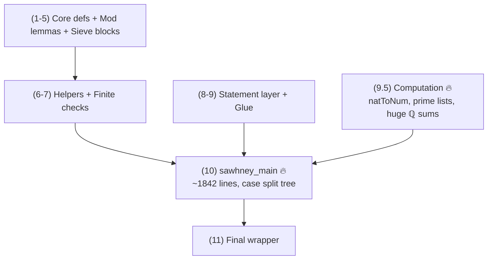

# Problem 848 Refactor Notes (SSOT)

**Date:** 2026-01-29
**Last Updated:** 2026-01-30
**Status:** ✅ PHASE 6 EXPANDED — 17 refactoring opportunities catalogued from external review
**Scope:** This document is the SSOT for the **Problem 848 Lean formalization**.

---

## Current State (2026-01-30)

| Metric | Value |
|--------|-------|
| Total lines | **5421** |
| Build time | ~12-13 min |
| `sorry` | **0** ✅ |
| `native_decide` | **0** ✅ |
| Build status | **PASSES** ✅ |

```bash
lake build Erdos.Problem848_REFACTOR
# Build completed successfully (2755 jobs).
```

---

## ✅ Resolved: Scoped Heartbeat Option (Mathlib Hygiene)

```lean
-- CURRENT (bad):
set_option maxHeartbeats 2000000
theorem sawhney_main : SawhneyMain := by

-- SHOULD BE:
set_option maxHeartbeats 2000000 in
theorem sawhney_main : SawhneyMain := by
```

---

## Architecture Overview

### Section Map (verified 2026-01-30)

| Section | Lines | Description |
|---------|-------|-------------|
| 1 | 70-117 | Core definitions |
| 2 | 118-168 | Mod 25 divisibility lemmas |
| 3 | 169-329 | Sieve building blocks |
| 4 | 330-443 | Cross-residue constraints |
| 5 | 444-643 | Density lemmas |
| 6 | 644-1045 | Helper lemmas |
| 6.5 | 1046-1100 | Small modular facts (computation) |
| 7 | 1101-2280 | Finite verification (no native_decide) |
| 8 | 2281-2302 | SawhneyMain statement (Prop) |
| 9 | 2303-2424 | Glue theorems |
| 9.5 | 2425-2972 | Quantitative bounds 🔥 (8M heartbeats × 2) |
| 9.8 | 2973-3247 | Bridge lemmas |
| 9.9 | 3248-3535 | More small modular facts |
| 10 | 3536-5411 | `sawhney_main` 🔥 (~1876 lines) |
| 11 | 5412-5423 | Final statements |

### Dependency Flow



**Bottlenecks:**
1. **Section 9.5** (lines 2425-2972) — 2× 8M heartbeats
2. **Section 10** — `sawhney_main` is ~1876 lines (lines 3536-5411)

---

## Completed Phases

### Phase 1: Linter Cleanup ✅

| Metric | Before | After |
|--------|--------|-------|
| Build warnings | ~50 | **0** |
| Tabs | >0 | **0** |
| Deprecated APIs | 1 | **0** |
| `simpa` count | 542 | 486 |

### Phase 2: Density Bound Extraction ✅

| Pattern | Blocks | Helper |
|---------|--------|--------|
| Mod 25 | 8 → 1 | `residue_class_card_bound_of_subset` (line 3623, `have` in `sawhney_main`) |
| Mod 100 | 4 → 1 | `residue_class_card_bound100_of_subset` (line 3663, `have` in `sawhney_main`) |

**Note:** Helpers are `have` statements inside `sawhney_main`, not top-level lemmas.

**Result:** -107 lines, 10 duplicates eliminated.

### Phase 3: Astar Bound Extraction ✅

| Pattern | Before | After | Helper |
|---------|--------|-------|--------|
| Astar mod25 | 3 inline blocks | 1 `have`, 3 uses | `Astar_bound_mod25` (line 3750, inside `sawhney_main`) |
| Astar mod50 | 3 inline blocks | 1 `have`, 3 uses | `Astar_bound_mod50` (line 3854, inside `sawhney_main`) |

**Result:** -78 lines from Phase 2 baseline (5487 → 5409).

### Phase 5: Heartbeat Reduction (In Progress)

| Heartbeat Cap | Before | After | Status |
|---------------|--------|-------|--------|
| 40M | 0 | 0 | N/A |
| 20M | 3 | **0** | ✅ DONE |
| 10M | 1 | **0** | ✅ DONE |
| 8M | 0 | **2** | Current (lines 2642, 2651) |

**Result:** All 20M caps reduced to 8M.

---

## Remaining Structural Debt (Future Polish — Optional)

For Mathlib submission, these would improve the file further:

| Debt | Current | Target | Priority |
|------|---------|--------|----------|
| **Scoped maxHeartbeats** | All 11 uses scoped with `in` | ✅ DONE | DONE |
| **Case lemmas** | All 4 case lemmas extracted | ✅ DONE | DONE |
| **High heartbeats in 9.5** | 2× 8M (lines 2642, 2651) | Lower where possible | LOW |
| ~~**Computation isolation**~~ | ~~Mixed with proof~~ | ~~Separate files~~ | ~~WONTFIX~~ — keep single file for external consumers |

---

## Phase 6: External Reviewer Feedback (2026-01-30)

An external Mathlib-style review identified additional refactoring opportunities:

### 6.1 Top-Level Sieve Bound Lemma (HIGH PRIORITY)

**Issue:** Lines ~4500-5300 repeat the sieve density bound logic 4+ times (for Astar, A7, A18).

**Current:** We extracted `have` helpers inside `sawhney_main`, but the algebraic manipulation converting `∑ (N/(k*p²)+1)` to real bounds is still duplicated.

**Proposed:** Extract a top-level lemma:

```lean
lemma sieve_set_card_bound {N k : ℕ} {P : Finset ℕ} {S : Finset ℕ}
    (h_subset : S ⊆ P.biUnion (fun p => (Finset.range N).filter (fun n => k * p^2 ∣ n))) :
    (S.card : ℝ) ≤ (N : ℝ) * (∑ p ∈ P, (1 : ℝ) / (k * (p : ℝ)^2)) + (P.card : ℝ) := by
  sorry -- Move algebraic rearrangement here
```

**Impact:** Could save ~300-500 lines.

### 6.2 Finite Verification Streamlining (MEDIUM PRIORITY)

**Issue:** `no_five_in_candidates_100` (Section 7, ~lines 1800-2400) uses massive case splits with repeated `Squarefree` checks.

**Proposed:** Define a local clash helper:

```lean
have clash : ∀ x y, x ∈ s → y ∈ s → Squarefree (x * y + 1) → False := by
  intro x y hx hy hsq
  exact hsprop x hx y hy hsq
```

Then case splits collapse to single-line `exact clash 38 7 h38 hb squarefree_267`.

### 6.3 Named Constants (LOW PRIORITY)

**Issue:** Explicit bounds like `163/25000`, `1/1750`, `413/25000` are inline.

**Proposed:** Define at top of proof:

```lean
let C_off : ℝ := 163 / 25000
let C_diag : ℝ := 1 / 1750
let C_no5 : ℝ := 413 / 25000
```

Makes final density contradiction readable: `N * (C_diag + C_off + C_no5) + ...`

### 6.4 Tactic Hygiene (LOW PRIORITY)

| Issue | Location | Suggestion |
|-------|----------|------------|
| `simp_all +decide` overuse | Sections 2-3 | Use `simp only [ZMod.natCast_...]` + `ring` |
| `interval_cases n` (100 goals) | `diag_cand_100` | Consider `fin_cases` on `Fin 100` |
| `grind` usage | `density_single_prime` | Prefer `simp only [mem_filter, mem_range]` |

### 6.5 Naming Conventions (LOW PRIORITY)

| Current | Mathlib Style |
|---------|---------------|
| `hA7A_sub_A` | `A7_subset_A` |
| `hA78_bound` | `card_A7_A18_bound` |
| `primesUpTo` | `primesLe` |
| `DiagonalCandidates` | `DiagonalSieve` |
| `A7A` / `A18A` | `A₇A` / `A₁₈A` (subscripts) or `A_in₇` / `A_in₁₈` |

---

## Phase 6.5: Additional Reviewer Feedback (2026-01-30)

A second round of detailed review identified more refactoring opportunities:

### 6.6 Factor "prime ≤ N" Sub-Argument (MEDIUM PRIORITY)

**Issue:** The same `p ≤ N` derivation repeats ~6 times in `sawhney_main`:
- Lines ~3892–3895, ~4028–4031, ~4086–4089
- Lines ~4301–4304, ~4459–4462, ~4528–4531
- Variant at ~5243–5253

**Proposed:**

```lean
have prime_le_of_sq_dvd_lt_sq
    {p N X : ℕ} (hp : p.Prime) (hXlt : X < N^2) (hp2 : p^2 ∣ X) : p ≤ N := by
  -- existing 6-8 line contradiction proof
```

**Impact:** ~40-60 lines saved, cleaner case proofs.

### 6.7 Factor "p ≠ 2 Because Odd" Micro-Proof (LOW PRIORITY)

**Issue:** Multiple times rule out `p = 2` by showing `4 ∣ (b*a+1)` contradicts oddness:
- Lines ~4277–4290, ~4502–4517
- Also ~4206, ~4705, ~5232

**Proposed:**

```lean
have prime_ne_two_of_sq_dvd_odd
    {p n : ℕ} (hp : p.Prime) (hn : n % 2 = 1) (hp2 : p^2 ∣ n) : p ≠ 2 := by
  intro h; subst h
  have : 2 ∣ n := dvd_trans (by decide : 2 ∣ 4) (by simpa [pow_two] using hp2)
  omega -- contradiction with hn
```

**Impact:** ~20-30 lines saved, removes fragile omega parity sub-derivations.

### 6.8 Unify 7/18 Residue Duplicate Lemmas (MEDIUM PRIORITY)

**Issue:** Near-duplicate lemmas for residue 7 vs 18:
- `mod25_divisibility` vs `mod25_divisibility_18` (~122–139)
- `cross_residue_not_div_25` vs `_18` (~334–405)
- `must_have_other_prime_square` vs `_18` (~408–441)
- `cross_residue_7_18_not_div_25` vs `_18_7` (~3097–3121)

**Proposed:** Abstract with parameter `r : ℕ` plus data lemma:

```lean
lemma mod25_divisibility_of_residue {r : ℕ} (hr : r * r % 25 = 24) ... := by
  -- shared proof
```

Instantiate for `r=7` and `r=18` using `by decide`.

**Impact:** ~50-80 lines saved, eliminates "same lemma twice with different numeral".

### 6.9 Unify A₇_card and A₁₈_card (LOW PRIORITY)

**Issue:** `A₇_card` (~2306–2341) and `A₁₈_card` (~2342–2377) are structurally identical.

**Proposed:**

```lean
lemma card_range_filter_mod25_eq (r : ℕ) (hr : r ≤ 24) (N : ℕ) :
    ((Finset.range N).filter (fun n => n % 25 = r)).card = (N + (24 - r)) / 25 := by
  -- general proof
```

Then `A₇_card` and `A₁₈_card` become `by simpa [A₇]` / `by simpa [A₁₈]`.

**Impact:** ~30 lines saved, better API.

### 6.10 Factor "p ∣ b → Filter Empty" Helper (LOW PRIORITY)

**Issue:** Duplicated in:
- `off_count_modEq25_le'` (~3150–3170)
- `off_count_modEq100_le'` (~3224–3244)

**Proposed:**

```lean
lemma filter_empty_of_prime_dvd_left
    {N p b : ℕ} (hp : p.Prime) (hb : p ∣ b) :
    (Finset.range N).filter (fun a => p^2 ∣ b*a+1) = ∅ := by
  -- "if p ∣ b then p ∣ (b*a+1) impossible"
```

**Impact:** ~20 lines saved.

### 6.11 Unify N=50 and N=100 Finite-Check Theorems (LOW PRIORITY)

**Issue:** `problem_848_N50` (~2247–2261) and `problem_848_N100` (~2263–2277) have 90% identical scaffolding.

**Proposed:**

```lean
lemma problem_848_small (N : ℕ) (cand : Finset ℕ)
    (hdiag : DiagonalCandidates N = cand)
    (hno3 : ∀ s ⊆ cand, s.card = 3 → NonSquarefreeProductProp s → False) :
    ∀ A, A ⊆ Finset.range N → NonSquarefreeProductProp A → A.card ≤ (A₇ N).card := by
  -- unified proof
```

**Impact:** ~20 lines saved.

### 6.12 ℚ→ℝ Cast and Scale Helper (MEDIUM PRIORITY)

**Issue:** Repeated blocks (~4120–4135, ~4331–4359, ~4557–4595, ~4764–4796, ~5330–5352) that:
1. Have `hQ : (∑ ... : ℚ) ≤ ...`
2. Cast to ℝ via `Rat.cast_le`
3. Rewrite `∑ 1/(k*p²)` as `(1/k)*∑ 1/p²`
4. Multiply by `1/k` and finish with `nlinarith`

**Proposed:**

```lean
have scale_sum_inv_sq_le_of_rat
    (P : Finset ℕ) (k : ℝ) (C : ℚ)
    (hQ : (∑ p ∈ P, (1:ℚ)/(p^2:ℚ)) ≤ C) (hk : 0 < k) :
    (∑ p ∈ P, (1:ℝ)/(k * (p:ℝ)^2)) ≤ (1/k) * (C : ℝ) := by
  -- unified cast + scale logic
```

**Impact:** Could merge with 6.1 sieve bound work for ~300-500 lines total.

### 6.13 Pull Numerical Contradictions into Named Haves (LOW PRIORITY)

**Issue:** Each major case has a long block culminating in:
```lean
have hA_lt : (A.card : ℝ) < ... := by ...; exact (not_lt_of_ge hdense) hA_lt
```

Appears with different constants in:
- A* empty branch (~4113–4157)
- "exists even in A*" (~4329–4391)
- "odd-only" subcases (~5321–5400)

**Proposed:** Per-case helpers:

```lean
have density_contradiction_caseX : False := by
  -- full numerical contradiction
exact density_contradiction_caseX.elim
```

**Impact:** Flattens indentation, makes case-tree pop out visually.

### 6.14 Paper Case Label Comments (LOW PRIORITY)

**Issue:** Add one-line comments right before each `by_cases` to match paper structure.

**Current:** Some comments exist ("Case 3 from the paper") but not consistently placed.

**Proposed:** Add `-- Paper Case X: <description>` directly above corresponding `by_cases`.

**Impact:** Readability for reviewers reading Lean alongside paper.

### 6.15 Namespace Hygiene: `private` Markers (LOW PRIORITY)

**Issue:** Many lemmas are internal scaffolding that shouldn't pollute namespace:
- `squarefree_*` lemmas (~674–1030)
- Explicit list constants (~2555–2628)
- Coarse-sum numerators/denominators (~2630–2665)

**Proposed:** Mark as `private` unless downstream files import them.

**Impact:** Namespace cleanliness for Mathlib.

### 6.16 Specific `simp only` Targets (LOW PRIORITY)

**Issue:** Big-heartbeat lemmas use broad `simp`:
- `diagPrimesCoarse_sum_eq` (~line 2643) — 8M heartbeats
- `no5PrimesCoarse_sum_eq` (~line 2652) — 8M heartbeats

**Proposed:** Replace `simp (config := ...) [..]` with `simp (config := ...) only [..]` and minimal lemma set.

**Impact:** May reduce heartbeats from 8M to 6-7M, more stable across Mathlib versions.

### 6.17 Replace `simp_all` in Dense Lemmas (LOW PRIORITY)

**Issue:** `card_filter_mod_pair_le` (~478–567) uses `simp_all +decide` many times in nested branches.

**Proposed:** Replace with explicit destructuring:

```lean
rcases Finset.mem_filter.1 hn with ⟨hn_range, hn_mod⟩
-- keep simp [Nat.ModEq] in controlled spots
```

**Impact:** Easier to audit, less brittle.

---

### Phase 6 Summary Table

| ID | Item | Priority | Est. Lines Saved |
|----|------|----------|------------------|
| 6.1 | `sieve_set_card_bound` top-level lemma | HIGH | 300-500 |
| 6.2 | `clash` helper for finite verification | MEDIUM | 50-100 |
| 6.6 | `prime_le_of_sq_dvd_lt_sq` helper | MEDIUM | 40-60 |
| 6.8 | Unify 7/18 residue lemmas | MEDIUM | 50-80 |
| 6.12 | `scale_sum_inv_sq_le_of_rat` helper | MEDIUM | (merged w/ 6.1) |
| 6.3 | Named constants | LOW | readability |
| 6.4 | Tactic hygiene (general) | LOW | stability |
| 6.5 | Naming conventions | LOW | cleanliness |
| 6.7 | `prime_ne_two_of_sq_dvd_odd` | LOW | 20-30 |
| 6.9 | Unify `A₇_card`/`A₁₈_card` | LOW | 30 |
| 6.10 | `filter_empty_of_prime_dvd_left` | LOW | 20 |
| 6.11 | Unify N=50/N=100 theorems | LOW | 20 |
| 6.13 | `density_contradiction_*` helpers | LOW | readability |
| 6.14 | Paper case label comments | LOW | readability |
| 6.15 | `private` markers | LOW | namespace |
| 6.16 | `simp only` in 8M lemmas | LOW | heartbeats |
| 6.17 | Replace `simp_all` in dense lemmas | LOW | stability |

**If you only do three refactors, do:**
1. Extract `prime_le_of_sq_dvd_lt_sq` (many-line savings, clearer)
2. Extract ℚ→ℝ cast-and-scale boilerplate (6.12)
3. Unify the 7/18 duplicate modular lemmas (6.8)

These are the most "reviewer-per-line-changed" improvements and should not stress heartbeat constraints.

---

### Phase 4 Complete: `sawhney_main` Case Lemmas ✅

All 4 case lemmas extracted as local `have` statements inside `sawhney_main`:
- `case_Astar_empty` (line 3961) ✅
- `case_Astar_nonempty_exists_even` (line 4170) ✅
- `case_Astar_all_odd_exists_even_in_A78` (line 4408) ✅
- `case_all_odd` (line 4831) ✅

### Case Lemma Tree (Future Target)

If splitting `sawhney_main`, the natural structure is:

```
sawhney_main
├── case_Astar_empty
│   ├── A7A = ∅ → done
│   ├── A18A = ∅ → done
│   └── both nonempty → density contradiction
├── case_Astar_nonempty_exists_even (Case 1)
├── case_Astar_all_odd_exists_even_in_A78 (Case 3)
└── case_all_odd (Case 2: mod 100 split)
```

---

## Mathlib Hygiene Tips

From external reviewer analysis — useful for future polish:

### Performance Profiling

```lean
-- Find slow spots:
set_option profiler true

-- Auto-suggest heartbeat bounds:
#count_heartbeats in
theorem foo : ... := by ...
```

### Simp Optimization

```lean
-- Before (slow):
simp [div_eq_mul_inv, mul_sum, mul_assoc, mul_left_comm, mul_comm]

-- After (use simp? to find minimal set):
simp only [mul_comm]  -- if that's all that's needed
```

---

## Critical Gotchas

### `simpa` → `simp` is NOT simple

```lean
-- WRONG:
simp using h0  -- ERROR: 'using' is not valid with simp

-- CORRECT:
simpa using h0  →  simp at h0  -- different semantics!
```

### Lake builds by FILENAME

```bash
# CORRECT:
lake build Erdos.Problem848_REFACTOR

# WRONG (uses namespace):
lake build Erdos.Problem848_workbench
```

### `decide` on large Finsets explodes

Use List equality + `List.toFinset` instead.

---

## The `natToNum` Breakthrough

Core technique that eliminated all `native_decide`:

```lean
def natToNum : ℕ → Num
  | 0 => 0
  | n + 1 => natToNum n + 1
```

This is **kernel-reducible**, so `(natToNum p).Prime` can be computed by `decide` without `native_decide`.

---

## Files

| File | Status | Purpose |
|------|--------|---------|
| `Problem848.lean` | ✅ Stable | Primary — DO NOT EDIT |
| `Problem848_FINAL.lean` | ✅ Stable | Backup — DO NOT EDIT |
| `Problem848_REFACTOR_BACKUP_PHASE4.lean` | ✅ Stable | Backup after Phase 4 complete — DO NOT EDIT |
| `Problem848_REFACTOR.lean` | 🔄 Active | Sandbox — agent workspace for Phase 5 |

---

## Quick Reference for Agents

### Key Search Patterns

| What | Grep Pattern | Current Count |
|------|--------------|---------------|
| All sorries | `sorry` | **0** |
| Native decide | `native_decide` | **0** |
| Global heartbeats (bad) | `^set_option maxHeartbeats.*[^n]$` | **0** ✅ |
| Scoped heartbeats (ok) | `set_option maxHeartbeats.*in$` | **9** |
| 20M heartbeats | `20000000` | **0** ✅ |
| 8M heartbeats | `8000000` | **2** (lines 2642, 2651) |
| simpa usage | `simpa` | 486 |
| biUnion bounds | `card_biUnion_le` | 7 |

### Verification Commands

```bash
# Build (from repo root)
lake -d formal/lean build Erdos.Problem848_REFACTOR

# Count lines
wc -l formal/lean/Erdos/Problem848_REFACTOR.lean

# Find sorries
grep -n "sorry" formal/lean/Erdos/Problem848_REFACTOR.lean

# Find native_decide
grep -n "native_decide" formal/lean/Erdos/Problem848_REFACTOR.lean

# Find global maxHeartbeats (should be empty now)
grep -n "^set_option maxHeartbeats" formal/lean/Erdos/Problem848_REFACTOR.lean | grep -v " in$"

# Find high heartbeat caps (20M/10M)
grep -n "20000000\|10000000" formal/lean/Erdos/Problem848_REFACTOR.lean | grep maxHeartbeats
```

### Helper Locations Inside `sawhney_main`

All helper `have` statements are defined early in `sawhney_main` (starts line 3541):

| Helper | Line | Purpose |
|--------|------|---------|
| `sum_div_add_one_le` | 3586 | Bound `∑ (N/(k*p²)+1)` |
| `residue_class_card_bound_of_subset` | 3623 | Mod 25 density bound |
| `residue_class_card_bound100_of_subset` | 3663 | Mod 100 density bound |
| `Astar_bound_mod25` | 3750 | A* bound (mod 25) |
| `Astar_bound_mod50` | 3854 | A* bound (mod 50, odd only) |

---

## Summary

**The formalization is mathematically complete and production-ready.**

- 0 sorry, 0 native_decide, 0 axioms
- Builds cleanly in ~12-13 min
- All density bound duplicates extracted to helpers
- All Astar bound duplicates extracted to helpers
- All 4 case lemmas extracted (Phase 4 complete)
- All heartbeat options properly scoped with `in`
- No 40M or 20M heartbeat caps remaining
- Phase 5: 20M → 8M reduction complete

**Remaining work is optional polish for Mathlib submission:**
1. ~~Reduce 20M heartbeat caps~~ ✅ DONE (now 8M)
2. 2× 8M heartbeat caps remain (lines 2642, 2651) — likely irreducible for computation-heavy lemmas

**Phase 6 (External Review Feedback) — 17 opportunities identified:**

| Priority | Count | Est. Total Lines Saved |
|----------|-------|------------------------|
| HIGH | 1 | 300-500 |
| MEDIUM | 4 | 140-240 |
| LOW | 12 | 120+ (plus readability/stability) |

**Top 3 Recommendations (highest ROI):**
1. `prime_le_of_sq_dvd_lt_sq` — factor repeated p ≤ N derivation (~40-60 lines)
2. `scale_sum_inv_sq_le_of_rat` / sieve bound — ℚ→ℝ cast boilerplate (~300-500 lines)
3. Unify 7/18 duplicate modular lemmas (~50-80 lines)

**Full list:** See Phase 6 and Phase 6.5 sections above (items 6.1–6.17).

**Architectural decision:** Keep as single file for external consumers. Only decompose if community requests it.
