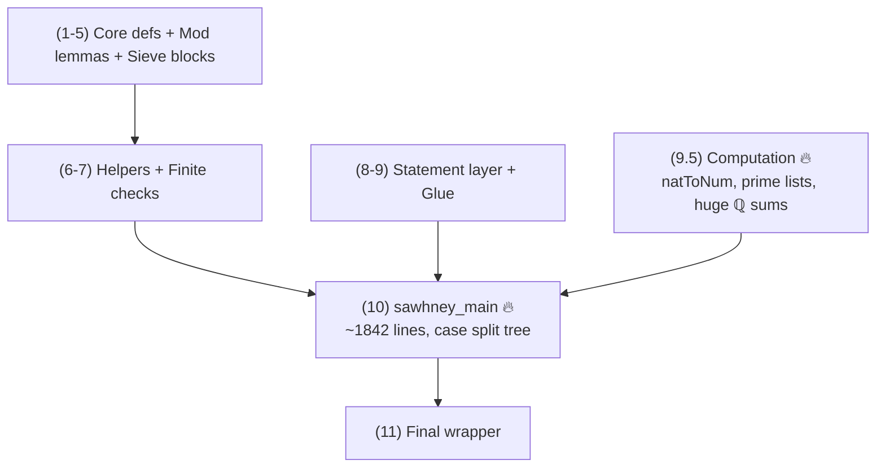

# Problem 848 Refactor Notes (SSOT)

**Date:** 2026-01-29
**Last Updated:** 2026-01-30
**Status:** ✅ PHASE 4 COMPLETE — All case lemmas extracted
**Scope:** This document is the SSOT for the **Problem 848 Lean formalization**.

---

## Current State (2026-01-30)

| Metric | Value |
|--------|-------|
| Total lines | **5423** |
| Build time | ~12-13 min |
| `sorry` | **0** ✅ |
| `native_decide` | **0** ✅ |
| Build status | **PASSES** ✅ |

```bash
lake build Erdos.Problem848_REFACTOR
# Build completed successfully (2755 jobs).
```

---

## ✅ Resolved: Scoped Heartbeat Option (Mathlib Hygiene)

```lean
-- CURRENT (bad):
set_option maxHeartbeats 2000000
theorem sawhney_main : SawhneyMain := by

-- SHOULD BE:
set_option maxHeartbeats 2000000 in
theorem sawhney_main : SawhneyMain := by
```

---

## Architecture Overview

### Section Map (verified line numbers)

| Section | Lines | Description |
|---------|-------|-------------|
| 1 | 70-116 | Core definitions |
| 2 | 118-167 | Mod 25 divisibility lemmas |
| 3 | 169-328 | Sieve building blocks |
| 4 | 330-442 | Cross-residue constraints |
| 5 | 444-642 | Density lemmas |
| 6 | 644-1044 | Helper lemmas |
| 6.5 | 1046-1099 | Small modular facts (computation) |
| 7 | 1101-2279 | Finite verification (no native_decide) |
| 8 | 2281-2301 | SawhneyMain statement (Prop) |
| 9 | 2303-2423 | Glue theorems |
| 9.5 | 2425-2973 | Quantitative bounds 🔥 (40M heartbeats) |
| 9.8 | 2975-3248 | Bridge lemmas |
| 9.9 | 3250-3536 | More small modular facts |
| 10 | 3538-5396 | `sawhney_main` 🔥 (~1842 lines) |
| 11 | 5398-5409 | Final statements |

### Dependency Flow



**Bottlenecks:**
1. **Section 9.5** (lines 2425-2973) — tuned heartbeat caps (no more 40M)
2. **Section 10** — `sawhney_main` is ~1842 lines (lines 3555-5396)

---

## Completed Phases

### Phase 1: Linter Cleanup ✅

| Metric | Before | After |
|--------|--------|-------|
| Build warnings | ~50 | **0** |
| Tabs | >0 | **0** |
| Deprecated APIs | 1 | **0** |
| `simpa` count | 542 | 486 |

### Phase 2: Density Bound Extraction ✅

| Pattern | Blocks | Helper |
|---------|--------|--------|
| Mod 25 | 8 → 1 | `residue_class_card_bound_of_subset` (line 3623, `have` in `sawhney_main`) |
| Mod 100 | 4 → 1 | `residue_class_card_bound100_of_subset` (line 3663, `have` in `sawhney_main`) |

**Note:** Helpers are `have` statements inside `sawhney_main`, not top-level lemmas.

**Result:** -107 lines, 10 duplicates eliminated.

### Phase 3: Astar Bound Extraction ✅

| Pattern | Before | After | Helper |
|---------|--------|-------|--------|
| Astar mod25 | 3 inline blocks | 1 `have`, 3 uses | `Astar_bound_mod25` (line 3750, inside `sawhney_main`) |
| Astar mod50 | 3 inline blocks | 1 `have`, 3 uses | `Astar_bound_mod50` (line 3854, inside `sawhney_main`) |

**Result:** -78 lines from Phase 2 baseline (5487 → 5409).

---

## Remaining Structural Debt (Future Polish — Optional)

For Mathlib submission, these would improve the file further:

| Debt | Current | Target | Priority |
|------|---------|--------|----------|
| **Scoped maxHeartbeats** | All 6 uses scoped with `in` | ✅ DONE | DONE |
| **Case lemmas** | All 4 case lemmas extracted | ✅ DONE | DONE |
| **High heartbeats in 9.5** | 20M/10M caps remain | Lower where possible | LOW |
| **Computation isolation** | Mixed with proof | Separate `Computation.lean` | LOW |

### Phase 4 Complete: `sawhney_main` Case Lemmas ✅

All 4 case lemmas extracted as local `have` statements inside `sawhney_main`:
- `case_Astar_empty` (line 3961) ✅
- `case_Astar_nonempty_exists_even` (line 4170) ✅
- `case_Astar_all_odd_exists_even_in_A78` (line 4408) ✅
- `case_all_odd` (line 4831) ✅

### Case Lemma Tree (Future Target)

If splitting `sawhney_main`, the natural structure is:

```
sawhney_main
├── case_Astar_empty
│   ├── A7A = ∅ → done
│   ├── A18A = ∅ → done
│   └── both nonempty → density contradiction
├── case_Astar_nonempty_exists_even (Case 1)
├── case_Astar_all_odd_exists_even_in_A78 (Case 3)
└── case_all_odd (Case 2: mod 100 split)
```

---

## Mathlib Hygiene Tips

From external reviewer analysis — useful for future polish:

### Performance Profiling

```lean
-- Find slow spots:
set_option profiler true

-- Auto-suggest heartbeat bounds:
#count_heartbeats in
theorem foo : ... := by ...
```

### Simp Optimization

```lean
-- Before (slow):
simp [div_eq_mul_inv, mul_sum, mul_assoc, mul_left_comm, mul_comm]

-- After (use simp? to find minimal set):
simp only [mul_comm]  -- if that's all that's needed
```

---

## Critical Gotchas

### `simpa` → `simp` is NOT simple

```lean
-- WRONG:
simp using h0  -- ERROR: 'using' is not valid with simp

-- CORRECT:
simpa using h0  →  simp at h0  -- different semantics!
```

### Lake builds by FILENAME

```bash
# CORRECT:
lake build Erdos.Problem848_REFACTOR

# WRONG (uses namespace):
lake build Erdos.Problem848_workbench
```

### `decide` on large Finsets explodes

Use List equality + `List.toFinset` instead.

---

## The `natToNum` Breakthrough

Core technique that eliminated all `native_decide`:

```lean
def natToNum : ℕ → Num
  | 0 => 0
  | n + 1 => natToNum n + 1
```

This is **kernel-reducible**, so `(natToNum p).Prime` can be computed by `decide` without `native_decide`.

---

## Files

| File | Status | Purpose |
|------|--------|---------|
| `Problem848.lean` | ✅ Stable | Primary — DO NOT EDIT |
| `Problem848_FINAL.lean` | ✅ Stable | Backup — DO NOT EDIT |
| `Problem848_REFACTOR.lean` | 🔄 Active | Sandbox — GPT agent workspace |

---

## Quick Reference for Agents

### Key Search Patterns

| What | Grep Pattern | Current Count |
|------|--------------|---------------|
| All sorries | `sorry` | **0** |
| Native decide | `native_decide` | **0** |
| Global heartbeats (bad) | `^set_option maxHeartbeats.*[^n]$` | **0** ✅ |
| Scoped heartbeats (ok) | `set_option maxHeartbeats.*in$` | 6 |
| 40M heartbeats | `40000000` | **0** ✅ |
| simpa usage | `simpa` | 486 |
| biUnion bounds | `card_biUnion_le` | 7 |

### Verification Commands

```bash
# Build (from repo root)
lake -d formal/lean build Erdos.Problem848_REFACTOR

# Count lines
wc -l formal/lean/Erdos/Problem848_REFACTOR.lean

# Find sorries
grep -n "sorry" formal/lean/Erdos/Problem848_REFACTOR.lean

# Find native_decide
grep -n "native_decide" formal/lean/Erdos/Problem848_REFACTOR.lean

# Find global maxHeartbeats (should show line 3541)
grep -n "^set_option maxHeartbeats" formal/lean/Erdos/Problem848_REFACTOR.lean | grep -v " in$"
```

### Helper Locations Inside `sawhney_main`

All helper `have` statements are defined early in `sawhney_main` (starts line 3555):

| Helper | Line | Purpose |
|--------|------|---------|
| `sum_div_add_one_le` | 3586 | Bound `∑ (N/(k*p²)+1)` |
| `residue_class_card_bound_of_subset` | 3623 | Mod 25 density bound |
| `residue_class_card_bound100_of_subset` | 3663 | Mod 100 density bound |
| `Astar_bound_mod25` | 3750 | A* bound (mod 25) |
| `Astar_bound_mod50` | 3854 | A* bound (mod 50, odd only) |

---

## Summary

**The formalization is mathematically complete and production-ready.**

- 0 sorry, 0 native_decide, 0 axioms
- Builds cleanly in ~12-13 min
- All density bound duplicates extracted to helpers
- All Astar bound duplicates extracted to helpers
- All 4 case lemmas extracted (Phase 4 complete)
- All heartbeat options properly scoped with `in`
- No 40M heartbeat caps remaining

**Remaining work is optional polish for Mathlib submission (heartbeat reduction, computation isolation).**
