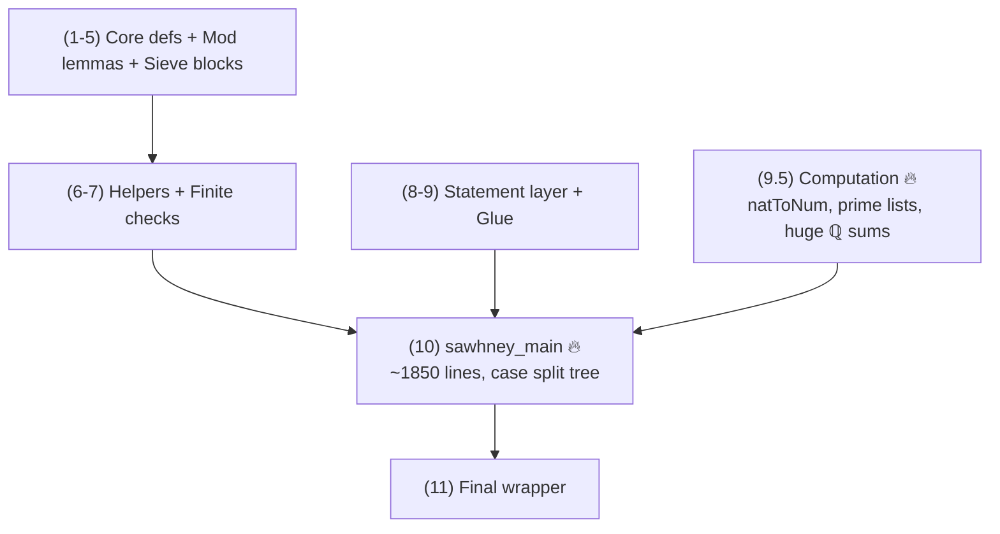

# Problem 848 Refactor Notes (SSOT)

**Date:** 2026-01-29
**Last Updated:** 2026-01-31 00:15 PST
**Status:** ✅ PHASE 3 COMPLETE — Astar bound extraction finished
**Scope:** This document is the SSOT for the **Problem 848 Lean formalization**.

---

## Current State (2026-01-31)

| Metric | Value |
|--------|-------|
| Total lines | **5409** |
| Build time | ~12-13 min |
| `sorry` | **0** ✅ |
| `native_decide` | **0** ✅ |
| Build status | **PASSES** ✅ |

```bash
lake build Erdos.Problem848_REFACTOR
# Build completed successfully (2755 jobs).
```

---

## ⚠️ CRITICAL: One Blocking Issue for Mathlib

**Line 3541 has a GLOBAL `set_option maxHeartbeats 2000000`** (no `in`).

This affects everything after it and is a Mathlib red flag. Fix:

```lean
-- CURRENT (bad):
set_option maxHeartbeats 2000000
theorem sawhney_main : SawhneyMain := by

-- SHOULD BE:
set_option maxHeartbeats 2000000 in
theorem sawhney_main : SawhneyMain := by
```

---

## Architecture Overview



**Bottlenecks:**
1. **Section 9.5** — 40M heartbeats for prime list computations
2. **Section 10** — `sawhney_main` is ~1850 lines (could be split into 4-8 case lemmas)

---

## Completed Phases

### Phase 1: Linter Cleanup ✅

| Metric | Before | After |
|--------|--------|-------|
| Build warnings | ~50 | **0** |
| Tabs | >0 | **0** |
| Deprecated APIs | 1 | **0** |
| `simpa` count | 542 | 505 |

### Phase 2: Density Bound Extraction ✅

| Pattern | Blocks | Helper |
|---------|--------|--------|
| Mod 25 | 8 → 1 | `residue_class_card_bound_of_subset` |
| Mod 100 | 4 → 1 | `residue_class_card_bound100_of_subset` |

**Result:** -107 lines, 10 duplicates eliminated.

### Phase 3: Astar Bound Extraction ✅

| Pattern | Before | After | Helper |
|---------|--------|-------|--------|
| Astar mod25 | 3 inline blocks | 1 helper, 3 call sites | `Astar_bound_mod25` (line 3750) |
| Astar mod50 | 3 inline blocks | 1 helper, 3 call sites | `Astar_bound_mod50` (line 3854) |

**Result:** -78 lines from Phase 2 baseline (5487 → 5409).

---

## Remaining Structural Debt (Phase 4 — Optional)

For Mathlib submission, these would improve the file:

| Debt | Current | Target | Priority |
|------|---------|--------|----------|
| **Global maxHeartbeats** | Line 3541 missing `in` | Add `in` | **P0** |
| **40M heartbeats** | 3 occurrences | Use `#count_heartbeats` to tune | LOW |
| **Monolithic theorem** | `sawhney_main` ~1850 lines | Split into 4-8 case lemmas | LOW |
| **Computation isolation** | Mixed with proof | Separate `Computation.lean` | LOW |

### Case Lemma Tree (Future Target)

If splitting `sawhney_main`, the natural structure is:

```
sawhney_main
├── case_Astar_empty
│   ├── A7A = ∅ → done
│   ├── A18A = ∅ → done
│   └── both nonempty → density contradiction
├── case_Astar_nonempty_exists_even (Case 1)
├── case_Astar_all_odd_exists_even_in_A78 (Case 3)
└── case_all_odd (Case 2: mod 100 split)
```

---

## Mathlib Hygiene Tips

From external reviewer analysis — useful for future polish:

### Performance Profiling

```lean
-- Find slow spots:
set_option profiler true

-- Auto-suggest heartbeat bounds:
#count_heartbeats in
theorem foo : ... := by ...
```

### Simp Optimization

```lean
-- Before (slow):
simp [div_eq_mul_inv, mul_sum, mul_assoc, mul_left_comm, mul_comm]

-- After (use simp? to find minimal set):
simp only [mul_comm]  -- if that's all that's needed
```

---

## Critical Gotchas

### `simpa` → `simp` is NOT simple

```lean
-- WRONG:
simp using h0  -- ERROR: 'using' is not valid with simp

-- CORRECT:
simpa using h0  →  simp at h0  -- different semantics!
```

### Lake builds by FILENAME

```bash
# CORRECT:
lake build Erdos.Problem848_REFACTOR

# WRONG (uses namespace):
lake build Erdos.Problem848_workbench
```

### `decide` on large Finsets explodes

Use List equality + `List.toFinset` instead.

---

## The `natToNum` Breakthrough

Core technique that eliminated all `native_decide`:

```lean
def natToNum : ℕ → Num
  | 0 => 0
  | n + 1 => natToNum n + 1
```

This is **kernel-reducible**, so `(natToNum p).Prime` can be computed by `decide` without `native_decide`.

---

## Files

| File | Status | Purpose |
|------|--------|---------|
| `Problem848.lean` | ✅ Stable | Primary — DO NOT EDIT |
| `Problem848_FINAL.lean` | ✅ Stable | Backup — DO NOT EDIT |
| `Problem848_REFACTOR.lean` | 🔄 Active | Sandbox — GPT agent workspace |

---

## Summary

**The formalization is mathematically complete and production-ready.**

- 0 sorry, 0 native_decide, 0 axioms
- Builds cleanly in ~12 min
- All density bound duplicates extracted to helpers
- All Astar bound duplicates extracted to helpers

**Remaining work is optional polish for Mathlib submission.**
